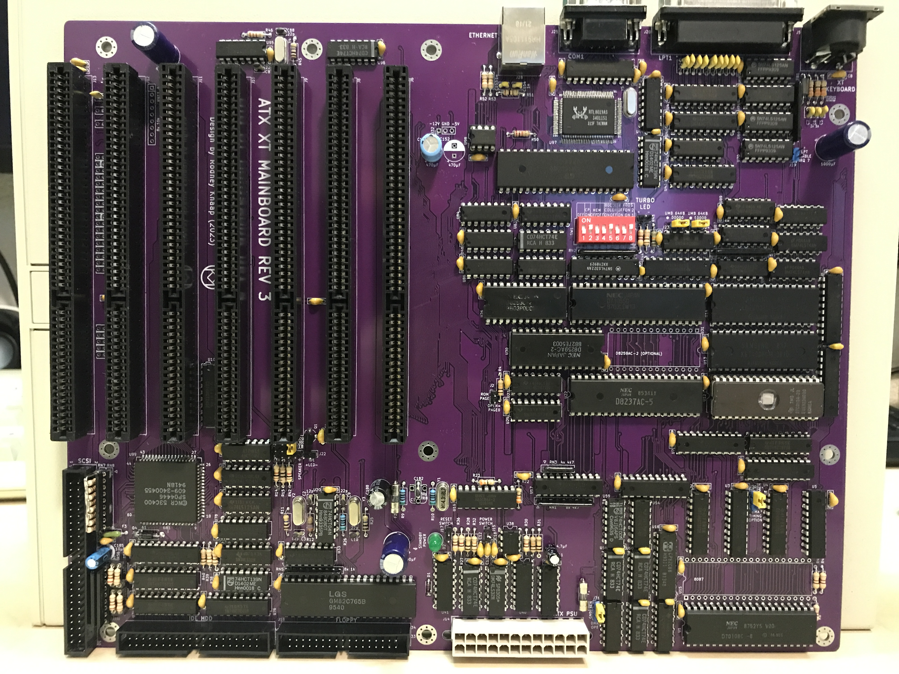

# ATX Turbo-XT Mainboard V3

I hereby publish the third revision of my ATX Turbo-XT mainboard design.
I had my doubts whether it would be wise to share my project, however the fact that keeping technology to myself prevents others to benefit from it made me decide for a release.
Open source is in my opinion the most important concept for all technology of mankind to move into the future in a way which has the potential to benefit all of us.

## Purpose and permitted use, cautions for a potential builder of this design

This project was created for historical purposes out of love for historical computing designs and for the purpose of enabling computing enthousiasts with a sufficient level of building and troubleshooting expertise to be able to experience the technology by building and troubleshooting the hardware described in this project.

## Besides the GPL3 license there are a few warnings and usage restrictions applicable:

No guarantees of function or fitness for any particular or useful purpose is given, building and using this design is at the sole responsibility of the builder.

Do not attempt this project unless you have the necessary electronics assembly expertise and experience, and know how to observe all electronics safety guidelines which are applicable.

It is not permitted to use the computer built from this design without the assumption of the possibility of loss of data or malfunction of the connected device. To be used strictly for personal hobby and experimental purposes only. No applications are permitted where failure of the device could result in damage or injury of any kind.

If you plan to use this design or any part of it in new designs, the acknowledgement of the designer and the design sources and inspirations, historical and modern, of all subparts contained within this design should be included and respected in your publication, to accredit the hard work, time and effort dedicated by the people before you who contributed to make your project possible.

No guarantee for any proper operation or suitability for any possible use or purpose is given, using the resulting hardware from this design is purely educational and experimental and not intended for serious applications. Loss of data is likely and to be expected when connecting any storage device or storage media to the resulting system from this design, or when configuring or operating any storage device or media with the system of this design.

When connecting this system to a computer network which contains stored information on it, it is at the sole responsibility and risk of the person making the connection, no guarantee is given against data loss or data corruption, malfunctions or failure of the whole computer network and/or any information contained inside it on other devices and media which are connected to the same network.

When building this project, the builder assumes personal responsibility for troubleshooting it and using the necessary care and expertise to make it function properly as defined by the design. 
You can email me with questions, but I will reply only if I have time and if I find the question to be valid. Which will probably also lead to an update here.
I want to primarily dedicate my time to new project development, I am not able to do any user support, so that's why I provide the elaborate info here which will be expanded if needed.

# Factors for proper operation and stability

Timing issues are likely to occur which require certain components to be of a suitable sufficient type to be able to meet the timing requirements for proper function. The prototype of the developer is proof of concept, please refer to the detailed partslist provided which includes type and manufacturer for all ICs where necessary, however each new build may pose it's own challenges to bring it to success. This design is by nature not a turnkey solution and will only function when using all the components of similar timing and behaviour as was used in the prototype. Determining the right components may likely be experimental in nature and require expertise, experience, effort and persistance.

Specifically the databus control transceivers and DMA handshaking circuits are most sensitive to exact types of at least equivalent timing as the types specified in the IC list, so refer to that list. The choice of DMA controller is a matter of trial and error, not all DMA controller chips are of sufficient timing to control a floppy disk using this design, specifically a floppy disk format poses the most exact testing situation to ensure proper DMA operation. Manufacturing date variations also may result in timing variations of the DMA controller. If the DMA handshake logic ICs are of faster types, this may also allow a more broad range of DMA controller ICs to work properly. Though I have not verified this with tests. Theoretically, using lower voltage logic or programmable logic may provide faster timing, though I have not chosen these methods in my design because I already achieved proper timing with the components I had available.

The 24Mhz oscillator load capacitors should be used as specified in the design, the oscillator should be checked to operate properly. If the total load (PCB capacitance + load capacitors) is too high, the oscillator will not run reliably and this will cause crashes, devide by zero errors, freezing, resets etc. Therefore ensure to observe the load capacitance suitable and proper stable operation of the oscillator. The ground shielding of the PCB traces of the clock signals comprise an addition to the load capacitance so the load capacitors themselves can be lower. For a turbo XT, it is not required to use two 8284 chips, one is sufficient. The DMA controller can properly operate on a fixed 50% duty cycle clock within the speed range of the chip so that is what I have provided. I derived the XT system clocks (keyboard, timer chip) from the DMA clock signal, which are also all fixed clock signals and do not vary when switching the CPU speed. CPU speed can be switched with the keyboard CTRL-ALT-num+ and CTRL-ALT-num- as controlled by the Super PC/Turbo XT BIOS (perfected by Jon Petrosky and Ya'akov Miles) at any moment without crashing the CPU. At least, I was not able to get the PC to crash by switching the speed at various moments.

There have been many capacitor footprints added to the edge of the ISA bus. These do not all need to be populated, but are instead intended for termination of signal reflections. Specifically, active high signals may be sensitive to noise generated from reflections. The best example is the RESETDRV signal on the ISA bus. If there is too much noise on such a signal it may cause certain I/O ICs such as UARTs to operate erroniously. For this reason the onboard UART RESET input has been purposely grounded. Use a 2.2nF capacitor for RESETDRV at least. Certain other signals may benefit from termination using lower capacitors. The higher the frequency of the signal, the lower the capacitor should be chosen as not to cause delays on the signal edges.

Databus transceivers which drive the ISA bus should be chosen of LS245 types which give better stability results. HCT types have better amplitudes but are more sensitive in the system. Refer to the IC list for best choices, though you could experiment after achieving a stable system to see if more HCT types are possible. For driving the SRAM memory databus, HCT types are fine.

This is an advanced project which contains many components, therefore the maximum care should be applied and maintained when soldering the PCB. Where using IC sockets, ensure they are proper quality sockets which are solid enough to create a reliable connection to the ICs inserted. Using sockets on DMA control circuits would be an advantage for trial and error testing to determine proper timing is reached. Use care to observe all IC orientations which differ due to layout considerations. Some ICs are tightly packed on the PCB, so first solder the ICs or sockets, then solder the decoupling capacitors. Also see the photo above for an example.

After soldering the project, it's a strong requirement to use proper lighting and magnification and systematically inspect all soldering points to detect any short circuits or open solder joints before powering up the system for testing. Short circuits which are not detected will probably damage ICs and introduce hidden defects into your project which will be even more difficult to detect after the damage is done. Fuses are put into the 5V and 12V lines which should blow on shorts or overcurrent. Keep in mind that the amount of current an ATX PSU can generate before it goes into protection mode also requires care of the project builder to ensure no short circuits occur which could destroy components or PCB traces.

If you do not agree or do not wish to accept the above risks, cautions and usage terms, do not make any attempts to build and operate the hardware in these design specifications.
It is not allowed to pass on this design to others without requiring them to read this entire document carefully and accept all of the terms.

# Acknowledgements

This project was inspired by:
- IBM Corporation who introduced the industry standard PC concept and design schematics
- Taiwanese clone XT builders who produced their own modifications in the turbo XT which also inspired this project
- testing with the Super PC/Turbo XT BIOS https://www.phatcode.net, 
- Sergey's HD floppy drive BIOS extension https://github.com/skiselev/floppy_bios
- concept and software of the XT-IDE universal BIOS https://www.xtideuniversalbios.org
- datasheets, application notes and specifications by:

LG Semiconductors (Goldstar) (GM82C765 FDC, GM16C550)
Standard Microsystems Corporation (FDC37C65C datasheet, FDC register access table)
Texas Instruments (GD75232)
Realtek (RTL8019AS)
NCR (53C400 SCSI)

Acknowledgements of people who were instrumental in preceeding developments upon which this design was elaborated:

[IBM PC development team](https://www.ibm.com/ibm/history/exhibits/pc25/pc25_birth.html)
[Some historical info](https://arstechnica.com/gadgets/2017/06/ibm-pc-history-part-1/)
[Bill Lowe](https://www.ibm.com/ibm/history/exhibits/builders/builders_lowe.html)
[Don Estridge](https://www.ibm.com/ibm/history/exhibits/builders/builders_estridge.html)

[Sergey Kiselev](http://www.malinov.com/Home/sergeys-projects/xi-8088)
[His HD Floppy BIOS](https://github.com/skiselev/floppy_bios)
I was inspired after seeing and reading about his 8088 projects, he also created the HD floppy BIOS extension.
 
[Super PC/Turbo XT BIOS by Plasma (Jon Ρetrosky and Ya'akov Miles)](https://www.phatcode.net)
An excellent BIOS for XT machines, far superior in stability and function to anything else I have tested.

Tilmann Reh and others (16 bit to 8 bit translation of IDE I/O in computer hardware for example as described in TCJ #53)
I have used my own adaptation of [J. Chapman's version(Glitchworks)](https://minuszerodegrees.net/xtide/rev_4/XT-IDE%20Rev%204%20-%20general.htm) of XT-IDE schematic after extensive testing with several circuit and component variations on an Amstrad PPC640. I studied all revisions of the circuits first before creating my own variations.
More information about the creation of XT-IDE hardware can be found [here](https://minuszerodegrees.net/xtide/XT-IDE%20-%20Basics.htm).

[XT-IDE universal BIOS project development team for developing the XT-IDE BIOS](https://www.xtideuniversalbios.org)
Amazing and extremely efficient software, fast disk access for XT and various AT computers.
Works with every IDE drive I have tested. Still under active development earlier in 2023.

All source data remains the copyright of the original creators and must be respected.
This design is only released for hobby computing enthousiasts and educational purposes, no profit is to be made from this design or derived work from it.

I have taken time to respectfully include all the above acknowledgements. If anyone or anything is left out, that is absolutely not intentional, please contact me and I will update this page.

After elaborately studying the available source design files which inspired the system, I conceived this design with my own variations, circuit additions and changes which I see as improvements according to my personal design views and preferences. Some logic types I have changed to get a better schematic perspective on an entire circuit area. My purpose was a good clear recreation in my own method, not to exactly copy the original. I have removed the DRAM refresh and parity check logic from the design.

I have designed most of the I/O control circuits using the chip manufacturer datasheets to determine the proper interfacing methods, ports etc suitable for this XT design.

# ROM BIOS

The choice of BIOS for operation of this mainboard is up to the builder, the BIOS used in the operation of my build works well, and is composed as follows, top to bottom segments in the ROM image are:

0k-8k    Super PC/Turbo XT BIOS (project by Jon Petrosky and Ya'akov Miles)  

8k-16k   XT-IDE BIOS file (by XT-IDE universal BIOS team)  
The BIOS must be configured to port 300/308 and XT-IDE v2 ("Chuck mod") hardware.
The BIOS image is to be corrected for checksum=0 by XT-IDE config software and then should be saved back into the BIOS.
Using an 8088 you need the ide_xt.bin, for the NEC V20 you can use the ide_xtp.bin.  

16k-24k  XT HD-Floppy BIOS extension (by Sergey Kiselev)  
Configuration of floppy drive config bytes according to instructions provided by Sergey.
It's best to configure your floppy drive configuration by setting the appropriate bytes in the image to correspond with the floppy drives you plan to connect.
All drives should be set to drive select 1 (counting from 0) and the standard floppy cable twisting should be used to choose the first and second drive.
Since it's a relatively modern FDC, floppy termination should be moderate for example 1k, and doesn't need to be done on all the floppy drives.
Possibly, floppy drive termination on the drives themselves can even be left out or only present on one drive.
The less resistance on the terminated signals, the less load on the FDC pins. 150 ohms is really too low a resistance to use and I recommend removing these when found on a drive and at least replacing with 1k, or leaving them out.  

24k-64k  Remaining 40k  program with blank space "00" hex codes.  
This comprises a 64k BIOS image, the design accommodates two BIOS images in the 128k ROM, the page to be used can be switched by a jumper or switch. For testing it's advised to program two identical BIOS images into the ROM first. Initially it's best to use an EPROM which cannot be erased by software if there is any software trying to write into the BIOS region. If you like to add other BIOS images you can simply include them into the BIOS image file since there are 5 segments of 8k available.  

What I did is to create two variations of the 64k BIOS, one which includes a DD 5,25 floppy drive, and the other includes a HD 5,25 floppy drive. I have added switches to the DS1 jumpers of my two 5,25 drives which enables to leave both connected to the floppy bus simultaniously. The switches change both the BIOS image selection and the drive selects. Using both a DD and HD 5,25 drive makes sure that any floppy disks are properly read and written, due to matching the proper track width compatibility of the original intended drives to the respective disks. In both of my BIOS versions, I have defined drive A: to be a 1,44MB HD 3,5 inch drive. Drive B settings contain the DD and HD versions of the 5,25 drives.

In order to create the BIOS image I used a cmd batch command.  

`copy /b blank8k.bin + blank8k.bin + blank8k.bin + blank8k.bin + blank8k.bin + floppy22_DD.bin + IDE_XTP.BIN + pcxtbios_phatcode.bin biosrom64k_dd_fdd.bin`  

`copy /b blank8k.bin + blank8k.bin + blank8k.bin + blank8k.bin + blank8k.bin + floppy22.bin + IDE_XTP.BIN + pcxtbios_phatcode.bin biosrom64k_hd_fdd.bin`  

`copy /b biosrom64k_hd_fdd.bin + biosrom64k_dd_fdd.bin !biosrom_floppy22_switch_dd_hd_config.bin`  

This should result in a 128kb file named !biosrom_floppy22_switch_dd_hd_config.bin  

The onboard RTL8019AS adapter is configured using the 93LC46 EEPROM. This EEPROM can be programmed using a programmer, I will provide a dump image of my example chip. The image also contains the MAC address so this should be varied slightly in your implementation.  

The LPT port does not need interrupt 7 to operate so the jumper should be left open because of limited interrupts available in an XT.
DMA timing jumpers provide alternatives for testing purposes, the settings indicated by the asterisk are defaults.  

Resources (besides obvious internal base XT chips):  

IO Ports:  
0300	XT-IDE  
0308	XT-IDE  
0340	LAN  
0378	LPT  
03F8	COM1  

IRQ list:  
IRQ0	system refresh timer  
IRQ1	Keyboard  
IRQ2	available  
IRQ3	LAN  
IRQ4	COM1  
IRQ5	available  
IRQ6	FDC  
IRQ7	SCSI  

DMA list:  
DMA 0	refresh dummy DMA  
DMA 1	free  
DMA 2	FDC  
DMA 3	free  

For the SCSI bus general practises for termination apply. The 53C400 is very solid, stable and fast and works really well with LS2000 drivers.
A SCSI bus is an ideal period correct way to provide plug-in storage and CDROM access for an XT PC.  

I operate my XT PC with a VGA card, the Video 7. Perhaps others like CGA or EGA which requires the correct dipswitch settings. I don't own any CGA monitor and besides I want to be able to use windows 3.0, play certain games and view photos in full VGA format on a modern monitor. I have tested a ATI Small Wonder card to operate properly on the composite output on a CRT.  

The schematic diagram is intentionally created as a single sheet for fastest navigation back and forth between various circuit areas. Such a large single sheet does slow down editing somewhat but it's an acceptable compromise in my opinion once you get used to it. It's not the "fullness" of the schematic, but the sheet size which slows down the schematic editor somewhat, which can be lessened by occasionally saving and closing the schematic, and then opening it again. Schematic and PCB design are made in KiCad 5.1.7. I know this is not the latest release however I am used to working in this version and I don't see a need to change that for now since it has proven to be sufficient for this purpose.  

This KiCad version is confirmed to be fully compatible with screenshots of JLCPCB guidelines of settings for creating the files for manufacturing. 
I will be including my own KiCad library additions in the source files which need to be unpacked into the appropriate kicad installation shared library folders.  

Update 24-12-2023: 
I have done further testing with ALS and F type logic ICs to improve on the DMA timing, which allows for supporting a wider range of 8237-clone DMA controllers to function completely in the system. This is vitally important for supporting floppy disk writing and formatting, and for supporting sound samples to be played back through a soundblaster compatible soundcard for example in DOS games.  
The result of my testing work is that after replacing with these ICs the DMA timing is much improved:

U24 - 74ALS573 (no F type available at the moment)  
U55 - 74F08  
U58 - 74F74  
U59 - 74F00  
U60 - 74F74  

These recommended ICs are now also included in the detailed txt partslist included in this GitHub project.  

I will not be further revising this design since I view it as completed.  

My next project is a 286 AT mainboard design comperable to the IBM 5170 and similar PCs, without the use of a chipset.  
I am currently using a IBM 5170 type 3 mainboard as a reference and test board for my 286 project.
I found that other clone boards I have tested so far contain errors and operate unreliably.
The only 100% reliable specimen of this design phase of PC development I have found and was able to test myself is the IBM one.  

After the 286 I will attempt to integrate the 486 SLC in a subsequent future revision. 
I am also working on a 5150 recreation in a complete modern ATX format, because I want an early 8 bit PC compatible computer which can still support a cassette interface for saving and loading programs.  

Thanks for your interest in this project. I would appreciate a message if anyone has built this mainboard.  

kind regards,  

Rodney
